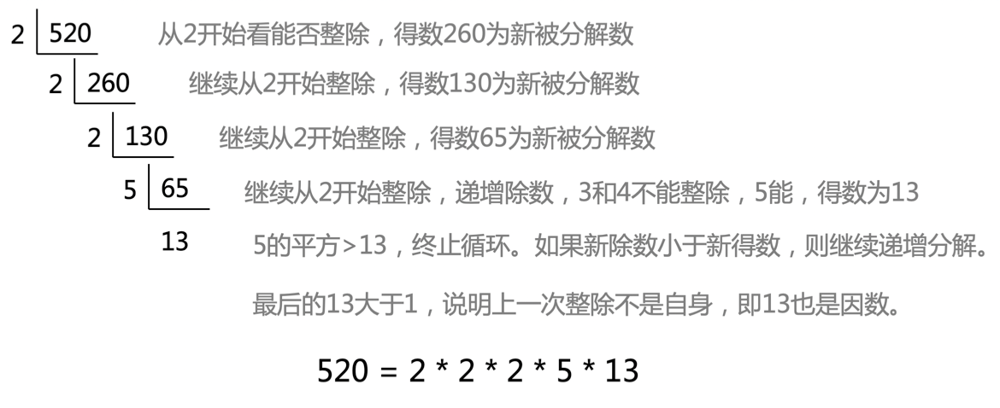

# 【质因数分解算法详解】C/Java/Go/Python/JS/Dart/Swift/Rust等不同语言实现

## 关于质因数分解算法的不同语言实现，通过实例来看不同语言的差异

## 什么是质因数算法？

  即任意一个合数可以分解为多个质数相乘。例如：

    20 = 2 * 2 * 5 
    45 = 3 * 3 * 5
    210 = 2 * 3 * 5 * 7
    520 = 2 * 2 * 2 * 5 * 13


按数学运算：列竖式或左右分解，拿能被整除的最小的素数做除数，不断整除得到新的得数，最后把所有的除数和最后的得数连起来就是。

## 算法基本思路


**除数的平方小于等于被分解数时，说明可以分解。除数从最小的质数2开始，不断递增，直到无法分解。**

- 先从最小的质数2开始整除被分解数
- 当能够整除时，说明分解成功，将整除后的得数作为新被分解数继续分解
- 继续从2开始整除，如果2无法整除，则递加到新的质数作为除数
- 直到将数字分解完，也就是递增数的平方大于被分解数时为止





## 代码实现思路
  
1. 先设立一个除数，从最小的质数开始，也就是2；
2. 当能够被当前除数整除时，该除数就是因数，将原数字设为被整除后的结果；
3. 继续从该除数开始整除新的结果，并不断循环；
4. 当无法被整除时，则递增除数，得到新的除数，继续第2步；
5. 直到除数的平方大于要分解的值，终止循环。 

  **最后所有能整除的除数与最后的大于1的无法分解的得数就是结果。**

## 不同语言的特点

  我们通过一个算法例子来搞明白各语言之间的差异，以下给出部分实现代码，详细代码需要查看源文件。

### C语言 
  C语言代码实现如下，该*factorize可以返回一个分解后的数组。从代码里可以看出，首先需要申请一个动态数组*result，长度为len的内存空间。该数组用来保存分解数，每分解出一个数字时则追加到数组中去，数组下标也随之增加。当分解完成后，最后返回分解数的数组。[factor.c](./factor.c)
  
```c
int *factorize(int num, int len) {
  int *result = (int *)malloc(len * sizeof(int));
  int i = 2;
  int result_idx = 0;
  // i的平方小于该数字，说明可以继续分解
  while (i * i <= num) {
    // 如果可以被i整除，则说明i是因数，继续以i分解
    while (num % i == 0) {
      result[result_idx] = i;
      // 每分解一次，原数值就赋值为除以i的结果
      num /= i;
      // 每增加一个因数，数组下标右移，以便追加到结果中
      result_idx++;
    }
    // 当无法被i整除时，i递增继续分解
    i++;
  }

  // 最后的分解数如果大于1说明上一次整除不是自身，即是最后1个因素
  if (num > 1) {
    result[result_idx]  = num;
  }
  return result;
}
```

代码逻辑：
1. 建立双循环，自最小的质数2开始不断递增遍历。
2. 外层循环为是否继续分解的条件，当i的乘方小于等于要分解的数字时，说明还可以分解。i不断递增，直到i的平方大于num为止。
3. 内循环则不断用num来除以约数，看能否除尽，能除尽则以得数作为新的num来继续分解，并将刚才的除数i追加到分解结果中。当i无法整除num时，说明当前i分解完成，则跳出内循环。
4. 当全部分解后，有的情况下最后的得数刚好被质数除尽，最后的得数为1，有的情况则质数的平方大于得数，终止了循环，此时该得数大于1，就是最后的因数。

### C++语言
  C++代码实现与C语言一致，因为没有用到面向对象，所以没有任何区别。[factor.cpp](./factor.cpp)
```c++
int *factorize(int num, int len) {
  int *result = (int *)malloc(len * sizeof(int));
  int i = 2;
  int result_idx = 0;
  while (i * i <= num) {
    while (num % i == 0) {
      result[result_idx] = i;
      num /= i;
      result_idx++;
    }
    i++;
  }
  if (num > 1) {
    result[result_idx]  = num;
  }
  return result;
}
```

### Java语言
  java版使用了ArrayList，是长度可变的列表，相比c语言使用数组来讲要方便些。代码上基本一样，如果也使用int数组，那代码就一模一样了。[Factor.java](./Factor.java)
```java
class Factor {
  public static List<Integer> factorize(int num) {
    int i = 2;
    List<Integer> result = new ArrayList<>();
    while (num > i * i) {
      while (num % i == 0) {
        result.add(i);
        num /= i;
      }
      i++;
    }
    if (num > 1) {
      result.add(num);
    }
    return result;
  }
}
```

### JavaScript语言
  JavaScript语言的数组没有类型，也无需指定长度，使用起来非常简单易懂。整个代码写法与java版本如出一辙。[factor.js](./factor.js)
```javascript
  function factorize(num) {
    let i = 2
    const result = []
    // 如果因数的平方小于该数字，说明可以继续分解
    while (i * i <= num) {
      // 从小到大逐个往上递增，当遇到能被整除时取出该因数
      while (num % i === 0) {
        result.push(i)
        // 除以因数之后得到的数再去分解
        num = num / i
      }
      i++
    }
    // 最后的分解数如果大于1说明无法除尽，即是最后1个因素
    if (num > 1) {
      result.push(num)
    }
    return result
  }
```

### TypeScript语言
  typescript是JS的一个变种或者称之为超集，完全兼容js语言，最后会编译成js来执行。主要是基于类、强类型，写法上与js几无差异。当然也可以不按类的方式来写。[PrimeFactor.ts](./PrimeFactor.ts)
```typescript
class PrimeFactor {
  num: number;
  result: Array<number>;
  constructor(num: number) {
    this.num = num;
  }
  factorize() {
    let i = 2;
    this.result = [];
    let num = this.num;
    while (i * i <= num) {
      while (num % i === 0) {
        this.result.push(i);
        num /= i;
      }
      i++;
    }
    if (num > 1) {
      this.result.push(num);
    }
  }
}
```

### Python语言
  python是面向对象语言，与java不同，方法也可以脱离于类存在。看python代码，可以说是最简单明了的，可以说最易懂。与js一样，python也是动态脚本语言，数组也是动态可变的，非常好用。其实python与js也很像，只是相比js来讲，是强类型的(当然也不是严格意义的强类型，这点与ts很像)。[factor.py](./factor.py)
```python
def factorize(num):
  i = 2
  result = []
  while (num >= i * i):
    while (num % i == 0):
      result.append(i)
      num = num / i
    i = i + 1
  if (num > 1):
    result.append(num)
  return result
```

### Go语言
  go语言不以类为依赖，起语言简练，语法上是c和js的混合体，变量声明也是var。数组空间也需要提前申请。无需括号和分号，相对比较简洁。从这段代码来看与c差异不大，本质上是c的变体。[factor.go](./factor.go)
```go
func factorize(num int, len int) []int {
  var result = make([]int, len)
  var i int = 2
  var resultIdx int = 0
  for i*i <= num {
    for num%i == 0 {
      result[resultIdx] = i
      num /= i
      resultIdx++
    }
    i++
  }
  if num > 1 {
    result[resultIdx] = num
  }
  return result
}
```

### Kotlin
  kotlin是java的一种语法糖，是完全兼容java语法的，最后也会变成class来执行。在Kotlin 中没有原始类型，一切都是对象。参数参数一旦将值分配给val，就无法更改。如果想重新分配它，则必须将其声明为var，而在Kotlin的方法中，参数隐式声明为final val，也无法更改参数。因此，这里将number赋值给变量num。[factor.kt](./factor.kt)
```kotlin
fun facorize(number: Int): List<Int> {
    val result = ArrayList<Int>();
    var i = 2;
    var num = number;
    while (i * i <= num) {
        while (num % i == 0) {
            num = num / i;
            result.add(i);
        }
        i++;
    }
    if (num > 1) {
        result.add(num);
    }
    return result;
}
```

### Dart
  dart是支持即时编译和提前编译的语言，语法与js基本上一致，只不过需要提前编译并且严格类型。但在实际使用上与js可谓非常接近，熟悉js或ts的开发者上手几乎0成本。这里取整除法与其他语言略有不同，如果不加~则得到小数了。[factor.dart](./factor.dart)
```dart
List factorize(int num) {
  // List<int> result = [];
  var result = [];
  int i  = 2;
  while (i * i <= num) {
    while (num % i == 0) {
      num = num ~/ i;
      result.add(i);
    }
    i++;
  }
  if (num > 1) {
    result.add(num);
  }
  return result;
}
```

### Swift
  swift是苹果推出的旨在替代Objective-C进行App开发的语言。从语法上跟js非常像，var声明，function第一型，与go也很类似，还不要分号，function缩写为func。从语言趋势上看，c+java+js的结合体会是大势所趋。尤其是类js，几乎所有最新的语言都在学习js的优点，当然都摒弃了js弱类型的特点。从swift看数组声明非常简单，无需指定长度，不断append即可。[factor.swift](./factor.swift)
```dart
 func factorize(num: Int) -> [String] {
  var result = [String]()
  var num = num
  var i = 2
  while (i * i <= num) {
    while (num % i == 0) {
      result.append(String(i))
      num = num / i
    }
    i += 1
  }
  if (num > 1) {
    result.append(String(num))
  }
  return result
}
```

### Objective-c
  OC是苹果原生的开发语言，来自于c语言，就像windows里面的VC++一样。但说实话OC的语法看起来不是很友好，从变量声明到对象调用，看起来与其他语言不是很一致，但总体上来也是类c的，所以本质上还是一样。数组要申请分配空间，长度无需指定。数组操作和对象引用的写法上与其他差异较大，但总体结构差异不大。[factor.m](./factor.m)
```objective-c
@interface Factor : NSObject
- (NSArray*)factorize:(int)num;
@end

@implementation Factor
- (NSArray*)factorize:(int)num
{
    // NSMutableArray *arr = [NSMutableArray arrayWithCapacity: 100];
    NSMutableArray *arr = [[NSMutableArray alloc] init];
    int i = 2;
    int resultIdx = 0;
    while (i * i < num) {
        while (num % i == 0) {
            [arr addObject: [NSNumber numberWithInt: i]];
            // NSLog(@"%d" @"=" @"%d", i, resultIdx);
            resultIdx++;
            num /= i;
        }
        i++;
    }
    if (num > 1) {
        [arr addObject: [NSNumber numberWithInt: num]];
        NSLog(@"%d", num);
    }
    return arr;
}
@end


int main(int argc, const char * argv[]) {
    @autoreleasepool {
        NSLog(@"Hi, this is about factor algorithm by Objective-C");
        // Factor *factor = [[Factor alloc] init];
        Factor *factor = [Factor new];
        int num = 120;
        NSArray *arr = [factor factorize: num];
        NSLog(@"%@", arr);

        // echo
        NSLog(@"%d = ", num);
        for (id obj in arr)
        {
            NSLog(@"%@ *", obj);
        }

        // echo
        printf("%d = ", num);
        for (int i = 0; i < [arr count]; i++)
        {
            if (i != 0) {
                printf(" * ");
            }
            printf("%d", [arr[i] intValue]);
        }

    }
    return 0;
}
```

### Rust
Rust最初是由Mozilla研究院提出，后经多方改良，于2015年正式发布。Rust的语法和C、C++非常类似，它的目标就是替代C和C++。

Rust的目标是高安全、高性能、高并发。Rust抛弃了影响性能的垃圾回收器，通过变量所有权的方式来自动释放内存。同时提供多线程支持且是内存安全的。

Rust 虽然没有没有专门的class来声明对象，但它支持面向对象。Rust可通过结构体来定义类，再通过impl来实现。在 Rust 中虽没有extends，但可以通过特性（trait）实现多态。

Rust从语法上足够精炼，风格比较像普通的高级语言，提供的元组（Tuple）和动态数组（Vector）、切片(Slice)模式非常方便，没有C/C++操作数据那么繁琐，但同时其又保持了底层语言的优越性能，能看得出来Rust是牛人精心打造的。所以未来，很可能Rust会取代C、C++以及Go和Java。

```rust
fn factorize(mut num: i32) -> Vec<i32> {
  let mut i = 2;
  let mut v: Vec<i32> = Vec::new();
  while i * i <= num {
    while num % i == 0 {
      println!("{:}", i);
      num = num / i;
      v.push(i);
    }
    i += 1;
  }
  if num > 1 {
    println!("{:}", num);
    v.push(num);
  }
  return v;
}

fn main() {
  println!("factorize:");
  let mut num = 20;
  println!("number is: {:}", num);
  let v: Vec<i32> = factorize(num);
  println!("{:?}", v);

  num = 140;
  println!("number is: {:}", num);
  let v: Vec<i32> = factorize(num);
  println!("{:?}", v);

  num = 120;
  println!("number is: {:}", num);
  let arr = factorize(num);
  println!("{:?}", arr);
}
```

## 源码
不同语言实现质因数分解算法代码：
https://github.com/microwind/algorithms/tree/main/factor