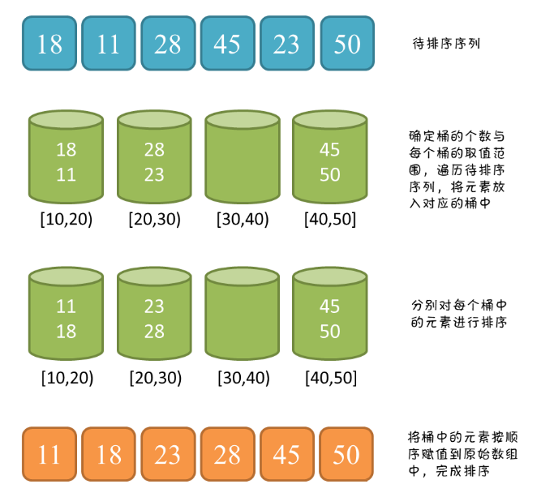
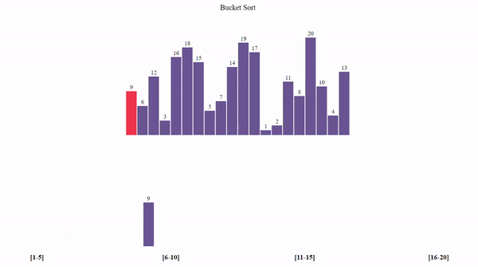

## 【桶排序算法详解】Java/Go/Python/JS/C不同语言实现

## 说明

桶排序（Bucket Sort）也称箱排序，是一个排序算法，工作原理是将数组分到几个桶里，桶的数量可由排序数组最大值与最小值关系决定，可以固定几个桶。每个桶内再通过插入、冒泡或或是以桶递归方式进行排序。

## 实现过程

1. 确定每个桶的大小以及桶的数量，桶大小为可以最大项与最小的差值除以最小值，桶的数量是大小差值除以桶大小；
2. 新建一个桶二维数组，用于存放桶数据，桶的数量和每个桶的大小就是第 1 步得到的值；
3. 遍历原始列表，再将数组项除以桶的个数得到桶的下标，将当前数组项存入到对应桶中；
4. 在存入桶中时，按顺序插入，保持桶内的顺序；
5. 数据全部放入桶之后，再遍历桶原始列表，将桶二维数组按顺序展开取出。

## 示意图




## 性能分析

平均时间复杂度：O(n + k)
最佳时间复杂度：O(n + k)
最差时间复杂度：O(n ^ 2)
空间复杂度：O(n * k)
稳定性：稳定

# 代码

## Java

```java
  /**
   * 桶标准排序，支持正负整数
   */
  public int[] bucketSort1(int[] arr) {
    int len = arr.length;
    int[] output = new int[len];
    int max = arr[0];
    int min = arr[0];
    for (int i = 1; i < len; i++) {
      if (arr[i] > max)
        max = arr[i];
      if (arr[i] < min)
        min = arr[i];
    }
    // 最大最小的下限
    if (max < 2) {
      max = 2;
    }
    if (min < 1) {
      min = 1;
    }

    int bucketSize = (max - min) / min + 1;
    int bucketNumber = (max - min) / bucketSize + 1;

    int[][] buckets = new int[bucketNumber][];
    int[] bucketsMemberLength = new int[bucketNumber];
    for (int i = 0; i < bucketNumber; i++) {
      buckets[i] = new int[len];
    }
    for (int i = 0; i < len; i++) {
      int item = arr[i];
      int idx = (item - min) / bucketSize;
      if (idx < 0) {
        idx = 0;
      }

      int[] bucket = buckets[idx];
      int bucketLen = bucketsMemberLength[idx];
      // The first member
      if (bucketLen == 0) {
        bucket[bucketLen] = item;
      } else {
        // Insert sort
        while (bucketLen-- > 0) {
          if (item < bucket[bucketLen]) {
            bucket[bucketLen + 1] = bucket[bucketLen];
            if (bucketLen == 0) {
              bucket[bucketLen] = item;
            }
          } else {
            bucket[bucketLen + 1] = item;
            break;
          }
        }
      }
      bucketsMemberLength[idx]++;
    }

    int idx = 0;
    for (int i = 0; i < bucketNumber; i++) {
      for (int j = 0; j < bucketsMemberLength[i]; j++) {
        output[idx] = buckets[i][j];
        idx++;
      }
    }

    return output;
  }
```

## Python

```py
'''
# 桶排序代码简版，负数全放在第1桶
'''
def bucket_sort1(arr):
    max_value = max(arr)
    min_value = min(arr)
    # min_value = 1 if min_value <= 0 else min_value
    # 设置桶的数量，可以任意设置，也可以根据最大、最小值来设置
    bucket_number = int(max_value - min_value) / min_value + 1
    bucket_number = len(arr) / 2 if bucket_number > len(arr) else bucket_number
    bucket_size = int(max_value - min_value) / bucket_number + 1
    # 设置list并填充默认值
    buckets = [None for i in range(min_value, max_value + 1)]
    for item in arr:
        # 当前项除以桶间距取整，决定应该放在某个桶内
        idx = int((item - min_value) / bucket_size)
        # 如果是负数就放在第一桶里面
        # print('bucket_number', bucket_number, 'bucket_size=', bucket_size, 'idx=', idx)
        idx = 0 if idx < 0 else idx
        if buckets[idx] == None:
            buckets[idx] = []
            buckets[idx].append(item)
        else:
            l = len(buckets[idx]) - 1
            while l >= 0:
                # 自后往前遍历，如果数字大于数组中的项则插入其后
                if item > buckets[idx][l]:
                    buckets[idx].insert(l + 1, item)
                    break
                    # 如果数字最小则插入到最前
                elif l == 0:
                    buckets[idx].insert(0, item)
                l -= 1

        # 按照下标和顺序取出桶内的数字，回填到一个数组中
    output = []
    for i in range(len(buckets)):
        if buckets[i]:
            output = output + buckets[i]
    return output
```

## Go

```go
/**
 * 桶标准排序，支持正负整数
 */
func bucketSort1(arr []int) []int {
  var arrLen = len(arr)
  var output = make([]int, arrLen)
  var max = arr[0]
  var min = arr[0]
  for i := 1; i < arrLen; i++ {
    if arr[i] > max {
      max = arr[i]
    }
    if arr[i] < min {
      min = arr[i]
    }
  }

  if max < 1 {
    max = 2
  }
  if min < 1 {
    min = 1
  }

  // 每个桶的容量大小，也就是桶的间隔，用最大减去最小，也可以自定义
  var bucketSize = (max-min)/min + 1
  // 桶的数量，可以任意，也可以根据容量大小计算
  var bucketNumber = (max-min)/bucketSize + 1

  // 定义桶二维数组，每个桶都是一个数组
  var buckets [][]int = make([][]int, bucketNumber)
  // 用来记录每个桶实际存入的数据长度，以便最后导出
  var bucketsMemberLength = make([]int, bucketNumber)

  // 设置每个桶的长度，默认为数组长度
  for i := 0; i < bucketNumber; i++ {
    buckets[i] = make([]int, arrLen)
  }
  // 确定桶的下标
  for i := 0; i < arrLen; i++ {
    var item = arr[i]
    var idx int = (item - min) / bucketSize
    // 下标最小为0，最大为桶数
    if idx < 0 {
      idx = 0
    } else if idx >= bucketNumber {
      idx = bucketNumber - 1
    }
    // 确定排序项对应的桶
    var bucket []int = buckets[idx]
    var bucketLen int = bucketsMemberLength[idx]

    // 桶里的第一个数据，直接插入
    if bucketLen == 0 {
      bucket[bucketLen] = item
    } else {
      // 桶里后来的数据，按插入排序
      for bucketLen > 0 {
        bucketLen -= 1
        // 如果插入项小于成员项，则将成员项逐个挪动
        if item < bucket[bucketLen] {
          bucket[bucketLen+1] = bucket[bucketLen]
          if bucketLen == 0 {
            bucket[bucketLen] = item
          }
        } else {
          // 如果插入项大于成员向，则追加在之后
          bucket[bucketLen+1] = item
          break
        }
      }
    }
    bucketsMemberLength[idx]++
  }

  var idx = 0
  for i := 0; i < bucketNumber; i++ {
    for j := 0; j < bucketsMemberLength[i]; j++ {
      output[idx] = buckets[i][j]
      idx++
    }
  }

  return output
}
```

## JS

```js
  /**
   * 桶排序支持负数，负数放在第1个桶里排序
   */
  function bucketSort1(arr) {
    let max = Math.max(...arr)
    let min = Math.min.apply(this, arr)
    max = Math.abs(max)
    min = Math.abs(min)
    if (max < min) {
      const tmp = max
      max = min
      min = tmp
    }
    // 设置桶的数量，可以任意设置，也可以根据最大、最小值来设置
    const bucketNumber = Math.abs(Math.floor((max - min) / min)) + 1
    const bucketSize = Math.abs(Math.floor((max - min) / bucketNumber)) + 1
    const buckets = []
    let idx
    arr.forEach((item, i) => {
      // 当前项除以桶数取整，决定应该放在某个桶内
      idx = Math.floor((item - min) / bucketSize)
      // 负数全放在第一个桶里，相当于负数按照插入方式排序
      idx = idx > 0 ? idx : 0

      if (!buckets[idx]) {
        buckets[idx] = []
        buckets[idx].push(item)
      } else {
        let len = buckets[idx].length
        while (len--) {
          // 自后往前遍历，如果数字大于数组中的项则插入其后
          if (item > buckets[idx][len]) {
            buckets[idx].splice(len + 1, 0, item)
            break
            // 如果数字最小则插入到最前
          } else if (len === 0) {
            buckets[idx].unshift(item)
          }
        }
      }
    })

    // 按照下标和顺序取出桶内的数字，回填到一个数组中
    let output = []
    buckets.forEach((bucketItem) => {
      if (bucketItem) {
        output = output.concat(bucketItem)
      }
    })
    return output
  }
```

## TS

```ts
  /**
   * 1. 桶排序代码简版，不支持负数
   */
  bucketSort1(arr: Array<number>) {
    const max = Math.max(...arr)
    let min = Math.min(...arr)
    if (max > 0 && min < 0) min = 1
    // 设置桶的数量，可以任意设置，也可以根据最大、最小值来设置
    const bucketNumber: number = Math.abs(Math.floor((max - min) / min)) + 1
    const bucketSize: number = Math.abs(Math.floor((max - min) / bucketNumber)) + 1
    const buckets: Array<any> = [];
    let idx: number;
    arr.forEach((item, i) => {
      // 当前项除以桶间距取整，决定应该放在某个桶内
      idx = Math.floor((item - min) / bucketSize);
      if (!buckets[idx]) {
        buckets[idx] = [];
        buckets[idx].push(item);
      } else {
        let len = buckets[idx].length;
        // 只能遍历下标为0的项，负数相当于丢弃
        while (len--) {
          // 自后往前遍历，如果数字大于数组中的项则插入其后
          if (item > buckets[idx][len]) {
            buckets[idx].splice(len + 1, 0, item);
            break;
            // 如果数字最小则插入到最前
          } else if (len === 0) {
            buckets[idx].unshift(item);
          }
        }
      }
    });
    // 按照下标和顺序取出桶内的数字，回填到一个数组中
    let output = [];
    buckets.forEach((bucketItem) => {
      if (bucketItem) {
        output = output.concat(bucketItem);
      }
    });
    return output;
  }
```

## C

```c
/**
 * 桶标准排序，支持正负整数
 * 记录每个桶实际使用长度
 * 通过插入排序来实现桶内排序
 */
void *bucketSort1(int arr[], int len)
{
  int max_value = arr[0];
  int min_value = arr[0];
  for (int i = 1; i < len; i++)
  {
    if (arr[i] > max_value)
      max_value = arr[i];
    if (arr[i] < min_value)
      min_value = arr[i];
  }
  if (max_value < 1)
    max_value = 2;
  if (min_value < 1)
    min_value = 1;

  // 桶的间隔为最大值减去最小再除以最小值
  int bucket_size = (max_value - min_value) / min_value + 1;
  // 一共分为几个桶
  int bucket_number = (max_value - min_value) / bucket_size + 1;

  printf("bucket_size=%d len=%d bucket_number=%d", bucket_size, len, bucket_number);
  // 每个桶申请与原数组一样长空间
  int **buckets = (int **)calloc(bucket_number, sizeof(int *));
  // 记录每个桶内容的实际长度，取出数据时不超过次长度
  int *buckets_real_length = malloc(bucket_number * sizeof(int));
  // 给数组填充一个默认值，初始为0
  memset(buckets_real_length, 0, 1 * sizeof(int));

  for (int i = 0; i < bucket_number; i++)
  {
    // 给每个桶设置长度为数组的长度
    buckets[i] = (int *)malloc(len * sizeof(int));
  }

  for (int i = 0; i < len; i++)
  {
    int item = arr[i];
    // 获得桶的下标，再将数据插入到所分配桶里的相应位置
    int idx = (item - min_value) / bucket_size;
    printf("\r\n i=%d item=%d idx=%d buckets_real_length[idx]=%d", i, item, idx, buckets_real_length[idx]);
    insert(buckets[idx], item, buckets_real_length[idx]);
    buckets_real_length[idx]++;
  }

  for (int i = 0; i < bucket_number; i++)
  {
    printArray(buckets[i], len);
  }

  int *output = malloc(len * sizeof(int));
  int output_idx = 0;
  for (int i = 0; i < bucket_number; i++)
  {
    for (int j = 0; j < buckets_real_length[i]; j++)
    {
      // 根据每个桶实际的长度，将桶内的数据按顺序取出
      output[output_idx] = buckets[i][j];
      output_idx++;
    }
    free(buckets[i]);
  }
  free(buckets);
  return output;
}
```
# 链接

桶排序算法源码：[https://github.com/microwind/algorithms/tree/master/sorts/bucketsort](https://github.com/microwind/algorithms/tree/master/sorts/bucketsort)

其他排序算法源码：[https://github.com/microwind/algorithms](https://github.com/microwind/algorithms)
