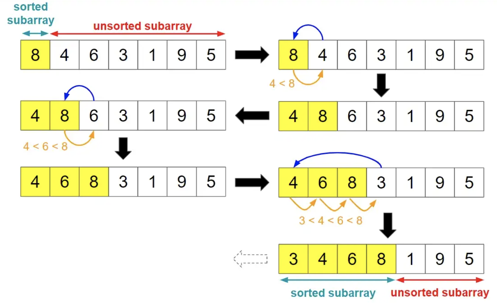

## Java/Go/Python/JS/C不同语言实现插入排序算法

## 说明
插入排序（Insertion Sort）是一种简单直观的排序算法。它的工作原理是将数据分为已排序和未排序两个序列，对于未排序的数据，在已排序序列中从后向前逐个遍历，找到相应位置插入的方式，其原理跟打扑克牌按顺序插入牌很类似。

## 实现过程
1. 将数组分为左右两个序列，分别表示已排序和未排序。外循环遍历未排序序列，内循环遍历已排序序列。
2. 从未排序序列中选取一项作为比较项，跟已排序列表项自后往前逐个对比，如果比较项小于列表成员，则将列表成员逐个右移，以便空出位置。
3. 当比较项大于等于已排序的成员时，将比较项放在该成员的后面。

## 示意图



## 性能分析

    平均时间复杂度：O(N^2)
    最差时间复杂度：O(N^2)
    空间复杂度：O(1)
    排序方式：In-place
    稳定性：稳定

# 代码

## Java
```java
  // java插入排序标准版，更多版本请看源码文件
  static int[] insertSort1(final int[] arr) {
    for (int i = 0; i < arr.length; i++) {
      int j = i;
      // 待排序中的比较项
      int current = arr[i];
      while (j-- > 0 && current < arr[j]) {
        // 将比较项跟已排序列表项逐个对比
        // 如果比较项小于列表项，则将列表项逐个右移
        arr[j + 1] = arr[j];
      }
      // 将比较项插入到指定位置
      arr[j + 1] = current;
    }
    return arr;
  }
```

## Python
```py
# python插入排序标准版本，更多实现版本请查看源文件
def insert_sort1(arr):
    l = len(arr)
    for i in range(l):
        j = i - 1
        current = arr[i]
        # 将该项自右往左与已排序项逐个对比，当遇到比自己大的项时，将该位置右移
        # 直到遇到小于等于自己的项则停止移动，表示插入成功
        print('i=' + str(i), ' j=' + str(j), 'current=' + str(current),
              'arr[i]=' + str(arr[i]), 'arr[j]=' + str(arr[j]), 'arr[]=', arr)
        while (j >= 0 and current < arr[j]):
            # 逐个位移
            arr[j + 1] = arr[j]
            j -= 1
        # 交换为当前项
        arr[j + 1] = current
    return arr
```

## Go
```go
// go插入排序标准版，其他版本请查看源文件
func insertSort1(arr []int) []int {
  var j int
  var current int
  var l = len(arr)

  for i := 0; i < l; i++ {
    // 当前项为第1项
    current = arr[i]
    // j是已排序的末尾位置
    j = i - 1

    // 内循环用来遍历已排序区间
    // 将该项自右往左与已排序项逐个对比，当遇到比自己大的项时，则将该位置逐项右移
    // 直到遇到小于等于自己的项则停止移动，表示插入成功
    for j >= 0 && current < arr[j] {
      // 逐项右移，以便空出插入项
      arr[j+1] = arr[j]
      j--
    }

    // 没有比自己大的项了，则插入到当前位置
    arr[j+1] = current
  }
  return arr
}
```

## JS
```js
  // js插入排序徐标准版，更多实现版本详见源码文件
  function insertSort1(arr) {
    let j
    let current
    const len = arr.length
    // 外循环用于遍历待排序区间，内循环用来遍历已排序区间
    for (let i = 0; i < len; i++) {
      j = i
      current = arr[i]
      // 将该项与已排序项逐个对比，当遇到比自己大的项时，逐项右移
      // 直到遇到小于等于自己的项则停止移动
      while (j-- > 0 && current < arr[j]) {
        // 将大于比较项的数逐个位移，以便空出位置
        arr[j + 1] = arr[j]
      }
      // 插入到指定位置
      arr[j + 1] = current
    }
    return arr
  }
```

## TS
```ts
  // TS标准版，其他版本请查看源码文件
  insertSort1(arr: Array<number>) {
    console.time('time')
    let j: number,
      current: number,
      l = arr.length
    // 外循环用于遍历待排序区间，内循环用来遍历已排序区间
    for (let i = 0; i < l; i++) {
      j = i
      current = arr[i]
      while (j-- > 0 && current < arr[j]) {
        // 逐个位移
        arr[j + 1] = arr[j]
      }
      // 交换为当前项
      arr[j + 1] = current
    }
    console.log('sort1:', arr)
    console.timeEnd('time')
    return arr
  }
```

## C
```c
int *insert_sort1(int arr[], int len)
{
  int j;
  int current;
  // 外循环用于遍历待排序区间，内循环用来遍历已排序区间
  for (int i = 0; i < len; i++)
  {
    int j = i;
    current = arr[i];
    // 将该项自右往左与已排序项逐个对比，当遇到比自己大的项时，将该位置右移
    // 直到遇到小于等于自己的项则停止移动，表示插入成功
    while (j-- > 0 && current < arr[j])
    {
      // 逐个位移，相当于整体右移
      arr[j + 1] = arr[j];
    }
    // 交换为当前项
    arr[j + 1] = current;
  }
  return arr;
}
```

# 链接
插入排序算法源码：[https://github.com/microwind/algorithms/tree/master/sorts/insertsort](https://github.com/microwind/algorithms/tree/master/sorts/insertsort)

其他排序算法源码：[https://github.com/microwind/algorithms](https://github.com/microwind/algorithms)